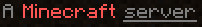

### Message of the Day

The message of the day, shown below each server entry in the client UI, can be changed with the `MOTD` environment variable, such as

    -e MOTD="My Server"

If you leave it off, a default is computed from the server type and version, such as

    A Paper Minecraft Server powered by Docker

That way you can easily differentiate between several servers you may have started.

The section symbol (§) and other unicode characters are automatically converted to allow [formatting codes](https://minecraft.fandom.com/wiki/Formatting_codes) to be used consistently with all server versions. For example,

     -e MOTD="A §l§cMinecraft§r §nserver"

renders as

A Minecraft <u>server</u>
  

<!--  -->
  

To produce a multi-line MOTD, you will need to double escape the newline such as

    -e MOTD="Line one\\nLine two"

You can use a tool like [MOTD Creator](https://mctools.org/motd-creator?text=A+%C2%A7l%C2%A7cMinecraft%C2%A7r+%C2%A7nserver) to help you format your MOTD.
